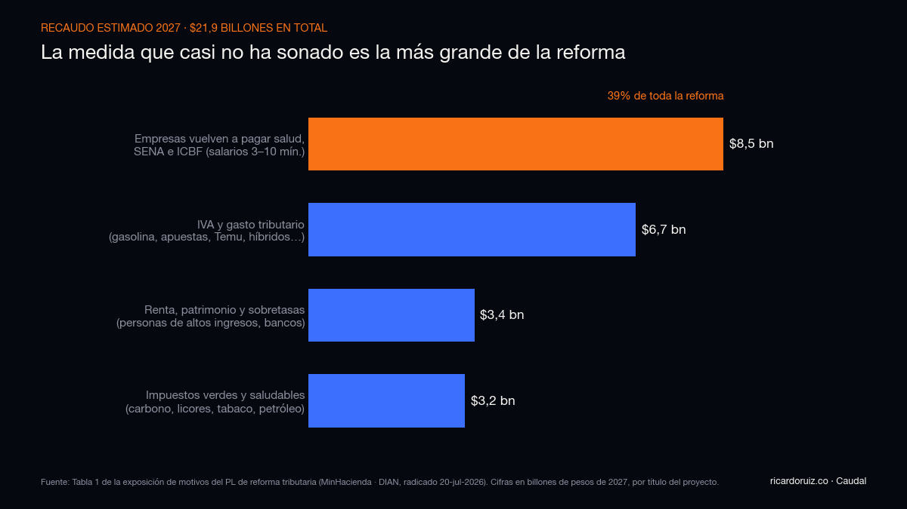
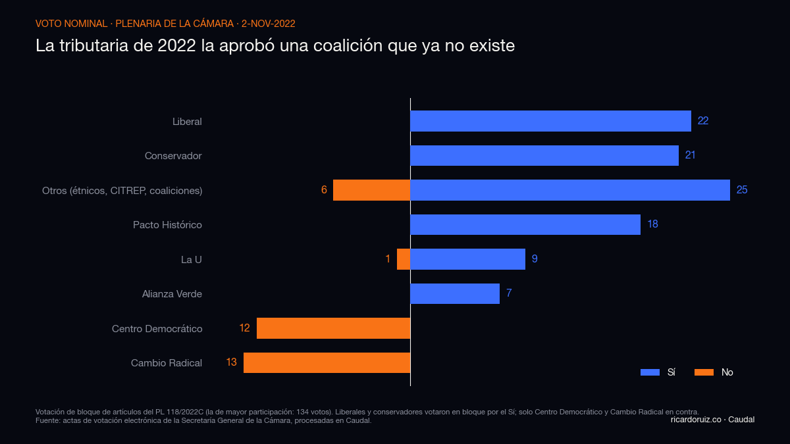
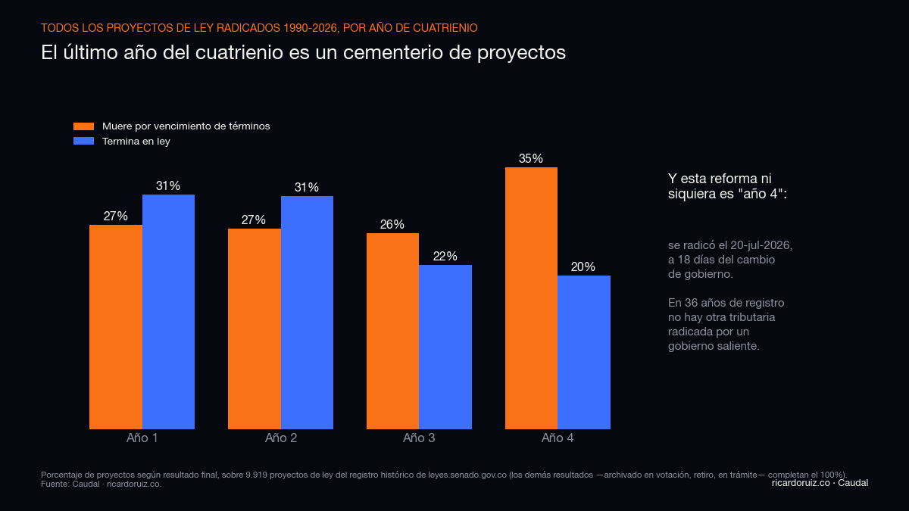

# La reforma tributaria que el gobierno radicó a 18 días de irse: qué propone, a quién toca y qué dice el histórico

*Columna · Ricardo Ruiz · ricardoruiz.co*
*Tono: tuteo neutro. Datos: texto radicado del Proyecto de Ley "Por medio de la cual se adopta una reforma tributaria" (MinHacienda, 20-jul-2026, 105 páginas) y Caudal, mi base del histórico legislativo colombiano: 13.172 proyectos de ley y actos legislativos scrapeados de leyes.senado.gov.co (1990-2026) + 317.455 votos nominales de la plenaria de la Cámara (2020-2026).*

---

El 20 de julio de 2026, el mismo día en que se instaló el nuevo Congreso, el Gobierno nacional radicó una reforma tributaria de **$21,9 billones**. Dieciocho días después, el 7 de agosto, ese Gobierno entrega el poder.

Léelo otra vez, porque ahí está toda la historia: un gobierno saliente le radicó una reforma de impuestos a un Congreso recién posesionado, que la debatiría —si la debate— bajo el gobierno entrante, que es de signo político opuesto. La firma el ministro de Hacienda, Germán Ávila, acompañado de unas 35 firmas de la nueva bancada del Pacto Histórico —incluida la de Iván Cepeda, que hace un mes perdió la segunda vuelta— y una de la Alianza Verde.

Yo me leí las 105 páginas y las crucé contra mi base del histórico legislativo. Esta columna hace dos cosas: te cuenta **qué propone** la reforma en cristiano, y te muestra **qué le pasa históricamente** a un proyecto así, radicado así, en ese momento del calendario. Adelanto la tesis: como paquete de medidas es la reforma más detallada que ha presentado este gobierno; como jugada legislativa, el registro histórico no le da casi ninguna probabilidad. Y las dos cosas importan, porque el hueco fiscal que la motiva no se va con el cambio de gobierno.

## Primero, el contexto: por qué $21,9 billones

Colombia activó en 2025 la **cláusula de escape de la Regla Fiscal**: el Estado reconoció formalmente que no puede cumplir sus metas de déficit y pidió permiso (a sí mismo, vía CONFIS) para desviarse unos años. El déficit proyectado es de -7,1% del PIB en 2025, -5,3% en 2026 y -4,9% en 2027, con la promesa de volver a la senda en 2028. Más del 90% del presupuesto es gasto inflexible —nóminas, pensiones, transferencias, deuda—, así que el ajuste por recorte tiene un techo bajito.

La reforma es la pata de ingresos de ese plan de retorno: $21,9 billones en 2027 (1,0% del PIB) y hasta $37 billones anuales en 2030. Si no pasa, el faltante se cubre —dice el propio texto— recortando lo único recortable: inversión pública.

Ese es el argumento del Gobierno. Es coherente en el papel. El problema es que el papel se radicó 18 días antes de que el Gobierno deje de existir.

## Qué propone, en cristiano

La reforma tiene cuatro títulos. Traduzco los que le tocan el bolsillo a la gente de a pie y los que definen la pelea política.

**Lo que encarece el día a día:**

- **Gasolina y diésel con IVA.** Hoy tienen tratamiento preferencial (tarifa reducida del 5% sobre el ingreso al productor, biocombustibles exentos). La reforma les pone IVA del 10% en 2027 y tarifa plena del 19% desde 2028, más IVA sobre el margen minorista. Es la medida de mayor recaudo del título de IVA: $3,6 billones en 2027 y $8 billones anuales desde 2028. El Ministerio la defiende con un argumento ambiental (los combustibles colombianos están entre los menos gravados de la región); el efecto práctico es tanqueada más cara.
- **Licores, vinos y cerveza artesanal de mezcla: IVA del 5% al 19%.** Cigarrillos: el impuesto por cajetilla casi se triplica ($4.068 → $11.200); el propio Gobierno estima que el precio del cigarrillo sube 57,7%. Los vapeadores, que hoy casi no tributan, entran con impuesto del 30% más $2.000 por mililitro.
- **Boletas de más de $500.000** (conciertos, palcos, fútbol premium): impuesto al consumo del 19%.
- **Apuestas online con IVA del 19% permanente.** Hoy lo pagan por un decreto temporal de la conmoción interior; la reforma lo vuelve definitivo.
- **Compras en Temu, Shein y similares:** se elimina la exención de IVA a las importaciones de menos de 200 dólares. Todo paquete paga 19%.
- **Carros híbridos: IVA del 5% al 19%.** El Gobierno argumenta que el beneficio se lo estaban quedando los hogares de ingresos altos, que son quienes los compran.
- **CDTs y rendimientos financieros:** se elimina el "componente inflacionario", el mecanismo que permitía no pagar renta sobre la parte del rendimiento que solo compensa la inflación. Los ahorradores declarantes pagarán sobre el rendimiento completo.

El Ministerio admite el costo: en el peor escenario, las medidas de IVA suman hasta 0,43 puntos a la inflación de 2027 y las de consumo y carbono hasta 0,74 más, y el paquete de licores y cigarrillos sube la pobreza monetaria 0,3 puntos (que, dice, se compensa con los programas sociales). Es de los pocos proyectos que he leído que trae su propia cuenta de daños.

**Lo que toca a los de arriba:**

- **Impuesto al patrimonio desde ~$2.200 millones** (el umbral baja de 72.000 a 40.000 UVT). Pasa de 32.000 a 105.000 contribuyentes —el 1,7% de los declarantes de renta—, con tarifas del 0,5% al 5%.
- **Renta de personas naturales:** las tarifas marginales suben desde rentas líquidas de 1.700 UVT (~$95 millones al año ya depurados) y la máxima pasa del 39% al **41%**. Se elimina la deducción de 72 UVT por dependiente (la del 10% del ingreso bruto se mantiene) y el descuento que dejaba dividendos medianos con tarifa efectiva de 0%.
- **Ganancias ocasionales** (herencias, venta de inmuebles con utilidad): la tarifa sube 10 puntos. Loterías, rifas y apuestas: del 20% al 30%.
- **Bancos:** la sobretasa de renta pasa de 5 a **15 puntos** y se vuelve permanente. Un banco pagaría 50% de renta.
- **Petróleo y carbón:** impuesto permanente del 1% a la exportación o primera venta, sobretasa del carbón igualada a la del petróleo, e impuesto al carbono subiendo de $29.070 a $42.000 por tonelada, con diésel y gas equiparados a la gasolina.
- **Plataformas digitales extranjeras** (presencia económica significativa): tarifa del 3% al 5% sobre ingresos brutos en Colombia.

**Y la medida más grande de todas, que casi no ha sonado:**

- **Las empresas vuelven a pagar salud, SENA e ICBF por los salarios entre 3 y 10 mínimos.** Desde 2012, los empleadores no pagan esos aportes (13,5% de la nómina) por trabajadores que ganen menos de 10 salarios mínimos. La reforma baja ese umbral a 3. Son **$8,5 billones al año — el 39% de todo el recaudo de 2027 —, la fuente individual más grande de la reforma**, por encima de la gasolina y del patrimonio. Toca a unos 675.000 trabajadores formales (el Gobierno subraya que el 64% está en empresas grandes y que la evidencia dice que ese alivio nunca generó mucho empleo en esos rangos salariales). Traducción: encarecer 13,5 puntos la nómina de los sueldos entre ~3 y ~10 mínimos. Ahí, no en el patrimonio, va a estar la pelea con los gremios.

## Ahora, el histórico: cómo les va a las tributarias

Aquí entra Caudal. En 36 años de registro del Senado (1990-2026), la regla de las reformas tributarias de origen gubernamental es simple: **cuando el gobierno tiene coalición, pasan; el Congreso colombiano casi nunca se las niega a un gobierno vivo.** La estructural de Santos en 2016, ley. La financiamiento de Duque en 2018, ley (la Corte la tumbó por vicios de forma y el mismo Congreso la reexpidió en 2019). La de la pandemia en 2021, ley. La de Petro en 2022, ley en tres meses.

Las excepciones son exactamente dos tipos, y los dos son instructivos:

1. **La calle.** La reforma de Carrasquilla de abril de 2021 no la hundió el Congreso: la retiró el propio Gobierno en medio del estallido social. En el registro aparece con un resultado rarísimo para una tributaria: RETIRADO.
2. **La coalición rota.** Las dos leyes de financiamiento de Petro —la de 2024 para el presupuesto de 2025 y la de 2025 para el de 2026— murieron **en las comisiones económicas, sin llegar jamás a una plenaria**. En mi base de 3.956 votaciones nominales de la plenaria de la Cámara (2020-2026) hay 44 votaciones de la tributaria de 2022. De los financiamientos de 2024 y 2025 hay **cero**. No los derrotaron votando: los dejaron morir sin votarlos.

O sea que el marcador de Petro en tributarias es **1 de 3**, y la trayectoria es una curva descendente que se explica con una sola votación. El 2 y 3 de noviembre de 2022, la plenaria de la Cámara aprobó su reforma tributaria con alrededor de 100 votos contra 25-30. El desglose por bancada de esa aprobación es una foto de museo: **Partido Liberal 22-0 a favor. Conservador 21-0. Pacto 18-0, La U 9-1, Verde 7-0. En contra, solos y en bloque, Centro Democrático (0-12) y Cambio Radical (0-13).** Esa coalición liberal-conservadora que le aprobó impuestos a un gobierno de izquierda se rompió en 2023 — y nunca volvió. Todo lo que le pasó a la agenda económica del gobierno después de esa fecha, incluidos los dos financiamientos muertos en comisión, es la resaca de esa ruptura.

## El reloj: lo que dice el año 4 (y esto ni siquiera es año 4)

En Caudal tengo medida la mortalidad legislativa por año de cuatrienio, sobre todos los proyectos desde 1990. El patrón es contundente:

- En los años 1 a 3, alrededor del 26-27% de los proyectos muere por vencimiento de términos (el famoso artículo 190 de la Ley 5ª) y entre el 22% y el 31% termina en ley.
- En el **año 4**, la muerte por reloj salta al **34,7%** y la tasa de éxito cae al 20,4%. El último año legislativo es un cementerio: los ponentes están en campaña, la agenda se encoge y los proyectos mueren por inanición de orden del día.

Pero ojo: esta reforma **ni siquiera es un proyecto de año 4**. Es algo más raro. Se radicó en el año 1 de un Congreso nuevo, por un gobierno al que le quedaban 18 días. Busqué el antecedente en los 36 años del registro: todas las tributarias y financiamientos de origen gubernamental que encontré se radicaron en los años 1 a 3 del gobierno que las presentó — típicamente en el semestre siguiente a la posesión, que es cuando el capital político está intacto. **No encontré un solo caso de un gobierno radicando una reforma tributaria después de perder las elecciones y a días de entregar el poder.** Esto no tiene curva histórica porque nunca había pasado.

Y la mecánica del trámite juega toda en contra. Para financiar el presupuesto de 2027, la reforma tendría que aprobarse antes de diciembre de 2026 — cuatro debates en cinco meses, en comisiones económicas cuya agenda ya no controla el Pacto, defendida por un Ministerio de Hacienda que a partir del 7 de agosto tendrá otro dueño. El gobierno entrante puede, sencillamente, pedir el archivo o dejarla en la nevera, que es como murieron los dos financiamientos. Y hay un dato más de mi base que cierra el candado: en la comisión, la probabilidad de que un proyecto sea efectivamente debatido cae de ~53% cuando abre el orden del día a ~21% cuando está de sexto en la fila. Un proyecto sin gobierno que lo empuje no abre ningún orden del día.

## Entonces, ¿para qué la radicaron?

Descartemos la ingenuidad: los firmantes leyeron el mismo calendario que tú y yo. Esta reforma cumple, me parece, tres funciones que no son aprobar artículos:

1. **Fijar la vara fiscal.** El hueco es real y está cuantificado: 1% del PIB en 2027. Al dejar radicado un paquete concreto de $21,9 billones, el gobierno saliente le transfiere al entrante la carga de la prueba: si la archivas, ¿de dónde van a salir? ¿O vas a recortar inversión, o a incumplir la senda de la cláusula de escape que tu propio CONFIS tendrá que administrar? Es un chantaje aritmético elegante, y la aritmética no cambia de partido el 7 de agosto.
2. **Dejar testamento programático.** El texto es la versión más destilada del ideario tributario del Pacto: progresividad en renta y patrimonio, impuestos verdes y saludables, desmonte de beneficios. Es la plataforma desde la cual la bancada —ahora de oposición— va a votar, criticar y contraproponer durante cuatro años.
3. **Marcar el contraste.** Cada gobierno entrante de este siglo radicó su propia tributaria en el primer año (Uribe 2002, Santos 2010, Duque 2018, Petro 2022 — todas ley). Lo más probable es que el gobierno De la Espriella haga lo mismo, con un diseño opuesto. Cuando eso pase, este texto radicado será el punto de comparación línea por línea: qué le quitaste a los bancos, qué le devolviste al patrimonio, qué hiciste con la gasolina.

## Lo que me deja el ejercicio

Si me preguntas por el pronóstico, el registro histórico habla sin ambigüedad: proyecto de gobierno sin gobierno, en el rincón muerto del calendario, con la vía de muerte más usada de la última década disponible y ensayada dos veces (dejarlo dormir en comisión, sin costo de votarlo). La probabilidad de que ESTE texto sea ley es marginal.

Pero el ejercicio de leerlo completo deja algo más útil que el pronóstico. El problema que diagnostica —un Estado con gasto rígido, gasto tributario regresivo de 8,5% del PIB concentrado en IVA, y una regla fiscal en cláusula de escape— se lo va a encontrar intacto el próximo ministro de Hacienda. Las opciones sobre la mesa también son las mismas: o más ingresos, o menos inversión, o más deuda. Este proyecto eligió la primera con una combinación concreta (40% empresas vía parafiscales, 30% consumo, 30% ricos y extractivas). El que venga elegirá otra mezcla. Pero alguien va a tener que ponerle números al mismo hueco, y relativamente pronto.

Mientras tanto, queda el dato para el archivo: la primera reforma tributaria de la historia reciente radicada por un gobierno que ya se iba. En Caudal le abrí su ficha. Casi seguro va a terminar en el mismo estante que los financiamientos de 2024 y 2025 — pero el estante, al menos, ya lo tenemos medido.

---

*Metodología y fuentes: texto radicado del PL de reforma tributaria (Ministerio de Hacienda, 20 de julio de 2026, exposición de motivos + 32 artículos). Cifras de recaudo, inflación, pobreza e incidencia: estimaciones del propio MHCP/DIAN contenidas en la exposición de motivos. Histórico legislativo: Caudal (ricardoruiz.co), base propia construida sobre el registro público de leyes.senado.gov.co — 9.919 proyectos de ley y 745 proyectos de acto legislativo (1990-2026) —, actas de votación electrónica de la plenaria de la Cámara (2020-2026, 3.956 votaciones · 317.455 votos individuales) y votaciones históricas de Congreso Visible (Universidad de los Andes). El desglose por bancada de la tributaria de 2022 corresponde a las votaciones nominales de plenaria de Cámara del 2 y 3 de noviembre de 2022 (PL 118/2022C). La mortalidad por año de cuatrienio se calcula sobre todos los proyectos radicados desde 1990 con resultado conocido.*
