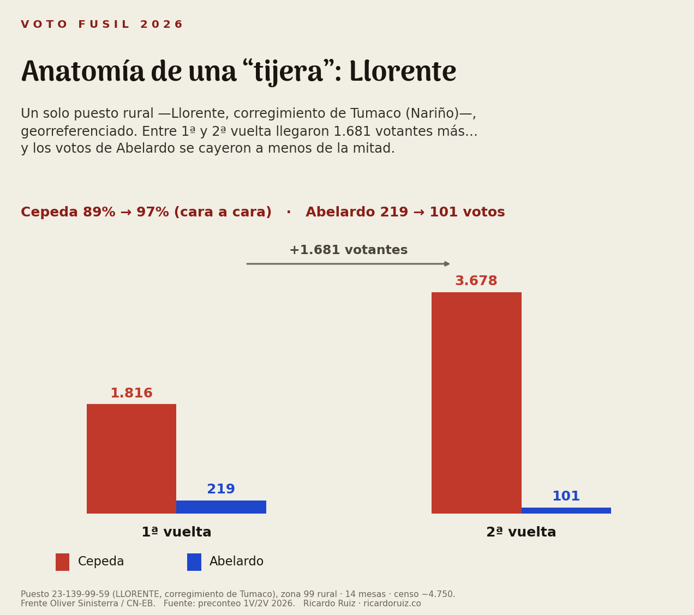

# El voto fusil de 2026: ni el robo que grita la oposición, ni el cuento que despachan los analistas

*Columna · Ricardo Ruiz · ricardoruiz.co*
*Tono: tuteo neutro. Datos: preconteo Registraduría 1V (31-may) y 2V (21-jun) 2026, capas oficiales de la Agencia Nacional de Tierras, censo Divipole 2026, Mapa de Riesgo Electoral MOE-CORE, Alertas Tempranas de la Defensoría y prensa verificada.*

---

Hay una pregunta que la segunda vuelta dejó abierta y que casi nadie está respondiendo bien: ¿hubo "voto fusil" en la segunda vuelta entre Iván Cepeda y Abelardo De La Espriella?

De un lado, la oposición convirtió las mesas donde Cepeda sacó 100% en prueba de un fraude armado: le habrían "robado" la elección a punta de fusil. Del otro, tres análisis serios y bien hechos —La Silla Vacía, Michael Weintraub con la MOE, y la Fundación Ideas para la Paz— mostraron que esas mesas unánimes pesan poquísimo y no movieron el resultado. Y ahí, en la práctica, cerraron la pregunta.

Yo bajé al preconteo puesto por puesto, y la respuesta que encontré no le sirve a ninguno de los dos extremos. **El fusil existe. Está probado en casos concretos. Opera en más de un bando. No fue masivo, no decidió la elección — y no está donde casi todos lo están buscando.** Esta columna es para mostrar cómo se llega ahí, y por qué importa más el mapa de dónde mirar que el veredicto de sí/no.

## El error de empezar y terminar en el 100%

El dato que prendió todo es real: Cepeda obtuvo el 100% de los votos en 675 mesas; Abelardo en 81, casi todas del exterior. Suena escandaloso hasta que recuerdas que una mesa rural tiene entre 200 y 600 votantes, y que en el Pacífico colombiano muchas de esas mesas son comunidades enteras que votan en bloque por decisión de asamblea.

Los tres referentes hicieron bien la aritmética gruesa: esos 100% pesan menos del 0,5% del total nacional, y Abelardo ganó por 250.830 votos. Que las mesas unánimes no cambiaron el resultado es cierto, y no vale la pena discutirlo. El problema es metodológico: el nivel de votación —que un puesto saque 100%— es una foto, no una película. Te dice cuánto, no qué pasó entre una vuelta y otra. Y el "voto fusil", si existe, es precisamente un fenómeno de movimiento.

Hay un detalle que se les escapó por trabajar a escala nacional y solo con resguardos indígenas. Cuando cruzas las 532 mesas 100% del Pacífico contra las capas oficiales de la Agencia Nacional de Tierras —resguardos indígenas **y** títulos colectivos de comunidades negras— el reparto es: **52% consejo comunitario afro, 27% resguardo indígena, 22% campesino-mestizo.** O sea, el grueso de la unanimidad no es indígena: es afro, territorios colectivos de la Ley 70 que deciden el voto en asamblea. Eso es voto en bloque legítimo, no fusil. Y reencuadra el debate: la imagen del "resguardo que vota 100%" es real pero minoritaria frente al consejo afro.

## La métrica que cambia la conversación: la tijera, a nivel puesto

Acá está el aporte. En vez del *nivel* de votación, medí la *dinámica de votos absolutos entre primera y segunda vuelta*. La llamo la **tijera**.

El razonamiento es simple. En la segunda vuelta subió la participación en casi todo el país (de 60% a 66%). Si llega más gente a votar, lo esperable es que **los dos** candidatos crezcan en votos absolutos. La derecha además venía fragmentada de primera vuelta —Abelardo, Paloma, Miguel Uribe, Botero repartiéndose el voto— y en segunda debía consolidarse mecánicamente al alza. Entonces el patrón sospechoso no es que un candidato saque mucho. Es que **uno crezca y el rival se desplome en votos absolutos**: que los votantes reales del perdedor, que en marzo estaban ahí, en junio simplemente desaparezcan, justo cuando llega más gente a las urnas.

Y aquí va la precisión que quiero subrayar, porque es la que más se diluye cuando este análisis se cuenta: **la tijera la mido a nivel de PUESTO rural, georreferenciado, no a nivel de municipio.** Cada puesto del preconteo tiene su código, su latitud y su longitud. Trabajo sobre los 14.206 puestos del país, y la inmensa mayoría de los que prenden la alarma son puestos de zona 99 —los rurales dispersos, los de vereda y corregimiento—. La agregación a municipio la hago solo *después*, y solo para una cosa: poder cruzar el puesto con los hechos de violencia, que la Defensoría y la prensa reportan a nivel de corregimiento o municipio. Pero la unidad de análisis, el punto en el mapa, es el puesto. Esa es la diferencia con quien trabaja a municipio y pierde el grano fino donde vive el fenómeno.

¿Qué encontré? El rival cayó en votos absolutos en 976 puestos (el 7% del país) — ya raro de por sí. Pero entre los puestos casi unánimes, donde el ganador saca 95% o más, la proporción salta al 42%; pasando el 98%, al 47%. La tijera vive en lo unánime. Y cuando me quedo con las **89 tijeras fuertes** —ganador con 95% o más y el rival cayendo al menos 10 votos absolutos— resulta que **todas son del lado de Cepeda**. (Del lado de Abelardo aparecen tres, y suaves; pero ahí hay un sesgo de tamaño que no me voy a ahorrar: sus puestos son chicos o del exterior, donde una tijera de votos absolutos casi no se puede formar.)

## Un caso con nombre propio: Llorente

Como esto suena abstracto, bajémoslo a un puesto concreto, con su código y sus coordenadas. El puesto de votación de **Llorente —un corregimiento de Tumaco, en Nariño, sobre el corredor cocalero que controla el frente Oliver Sinisterra—** es la radiografía perfecta de una tijera.

En primera vuelta votaron ahí 2.214 personas: Cepeda sacó 1.816 y Abelardo 219. En segunda vuelta llegaron 1.681 votantes más —la participación casi se duplicó—. Con tanta gente nueva entrando a las urnas, lo esperable era que **los dos** candidatos crecieran. Cepeda, en efecto, pasó de 1.816 a 3.678. Pero Abelardo, en vez de crecer con la marea, **se cayó de 219 a 101 votos**: perdió más de la mitad de los suyos justo cuando el puesto recibía la mayor avalancha de votantes de su historia reciente. Su porcentaje cara a cara contra Cepeda pasó de un ya-alto 89% a un 97%. Eso es la tijera: no que Cepeda saque mucho —siempre sacó mucho ahí—, sino que los votos reales del rival, que en marzo existían, se evaporen en junio mientras sube la participación. Un puesto, un nombre, un dato que ningún promedio nacional te deja ver.

## La inversión que ordena todo: lo étnico no es lo campesino

Si la columna deja una sola idea, que sea esta. **El 100% y la tijera no viven en el mismo territorio.**

Cuando descompongo las mesas 100% por tipo de territorio, son **78% étnicas** —afro e indígena—. Pero cuando descompongo las 89 tijeras fuertes, **el 72% son campesinas**, zonas de economía cocalera bajo control de las disidencias del EMC. Es casi una imagen en espejo: lo unánime es étnico, lo anómalo es campesino.

Y eso permite separar lo que el debate venía mezclando. En un resguardo Nasa o un consejo comunitario afro, el rival saca cero porque la comunidad decidió en asamblea: ahí hay bloque, no tijera — el rival nunca tuvo votos que perder. En el cañón del Micay o en la cordillera nariñense, en cambio, el rival tenía 100, 150 votos reales en marzo, y en junio tiene 2, con más gente votando que nunca. **Eso último es lo que hay que explicar.** Meter las dos cosas en el mismo saco es el error de la oposición (todo es fusil) y también el error simétrico de algunos analistas (todo es comunidad). No: una cosa es voto en bloque legítimo, otra es un desplome que pide explicación.

## La participación lo confirma

Si lo que pasara fuera presión a la abstención —que al rival le impidan votar—, los votantes del perdedor se habrían quedado en casa y la participación habría caído. Pasó exactamente lo contrario, y por eso este punto me parece el más decisivo.

En las zonas críticas la participación, calculada sobre el censo electoral de cada puesto, **arrancó por debajo del promedio nacional y lo sobrepasó**. Mientras el país subía 6 puntos entre vueltas, estas zonas subieron el doble: las diez zonas pasaron de 56% a 70% (+14), los puestos-tijera de 70% a 83% (+14), y Tumaco de 38% a 58% (+20 puntos). Llega más gente a votar **y** los votos del rival caen al piso. Esa combinación —movilización arriba, rival abajo— no es la huella de una comunidad que espontáneamente coincide; es la firma de una votación organizada, dirigida.

De paso, esto matiza —sin contradecirlo— el hallazgo de la FIP de que bajo control armado la participación cae unos 4 puntos en promedio. Es un promedio nacional correcto. Pero en estas zonas puntuales pasa lo opuesto, y el promedio justamente esconde el caso que nos interesa. (Una salvedad honesta: el censo solo existe a nivel de puesto, no de mesa. Para esta métrica, alcanza.)

## Las diez zonas, con nombre y con frente

Crucé los puestos-tijera con tres fuentes independientes: presencia de grupo armado (Mapa de Riesgo MOE-CORE 2026), Alertas Tempranas de la Defensoría, y prensa con hecho fechado. Las tres coinciden en **diez zonas**, todas en el corredor campesino-cocalero de Cauca y Nariño. Y todas bajo control de un mismo actor: el **EMC en su línea de alias 'Mordisco'**. Conviene precisarlo, porque se confunde: no es la facción de 'Calarcá', que negocia aparte. Son tres frentes concretos:

- El **frente Carlos Patiño**, en el sur del Cauca: Argelia, Patía, El Tambo, Mercaderes, Bolívar, Almaguer.
- El **frente Franco Benavides**, en la cordillera nariñense: Policarpa, Leiva, Cumbitara.
- El **frente Oliver Sinisterra** (con la Coordinadora del Pacífico), en Tumaco.

Seis de esas zonas tienen hecho fechado —grupo, Defensoría y prensa coincidiendo en una fecha—; cuatro tienen presencia, alerta y prensa estructural. La concentración no es casual: Bolívar (Cauca) aporta 18 de las tijeras fuertes, Tumaco 9, y entre las diez suman dos tercios del total nacional.

## Donde hay coacción documentada, el dato ya inclina la balanza

Acá quiero corregir algo que se viene diciendo con demasiada prudencia: que "el dato no permite saber si fue coacción o articulación comunitaria, y solo el terreno decide". Es verdad a medias, y la mitad que falta importa.

La tijera, sola, no prueba nada: una comunidad de voto en bloque puede conformarse genuinamente en una segunda vuelta binaria, sin que medie un arma. Por eso la presento como lo que es —un señalador de dónde mirar, no una sentencia—. Pero en varias de estas zonas **no estamos adivinando**. En Policarpa hubo una masacre en zona rural el 5 de marzo, y se filtró un audio de las disidencias exigiendo mostrar el certificado electoral para poder moverse. En Tumaco la Defensoría documentó una "gobernanza criminal" que llega a vetar candidaturas (Alerta Temprana 013-25), y a un líder indígena Awá lo asesinaron el 14 de junio, a una semana de la votación. Hay un cinturón de líderes sociales asesinados en el sur del Cauca. Cuando a la firma estadística —tijera + movilización forzada— le sumas estos hechos en el mismo lugar y en las mismas fechas, **la evidencia ya inclina la balanza**: ahí el fusil operó. El terreno sigue haciendo falta para validar cada denuncia puntual, sí; pero no para decidir si el fenómeno existe. Existe.

## La simetría que casi nadie quiso mirar: el Catatumbo

Y como el fusil no tiene un solo color, apliqué la misma lupa al otro lado: Catatumbo y Santanderes, donde arrasó Abelardo. A nivel de municipio aparece una **coincidencia** que vale la pena nombrar con cuidado: la ideología del grupo armado que controla cada territorio suele alinearse con la mayoría electoral de ese municipio.

Donde manda el ELN, ganó Cepeda: El Tarra 82%, Teorama 86%, San Calixto 89%. Donde mandan los grupos de derecha —el Clan del Golfo, las Autodefensas de la Sierra Nevada y el Frente 33-EMBF de alias 'Calarcá'— ganó Abelardo: Sardinata 89%, Ábrego 82%, Ocaña 71%, Tibú 60%.

Pero subrayo la palabra **coincidencia**, y la diferencia con nuestras diez zonas. Allá tenemos la firma estadística fina —la tijera de votos absolutos puesto por puesto— sumada a hechos documentados de coacción electoral. Aquí, a nivel de municipio, no tenemos ni lo uno ni lo otro: no hay tijera mesa-a-mesa visible ni un solo hecho de presión electoral documentado en 2026. Esa coincidencia entre el control armado y el voto puede deberse a coacción, sí, pero también —y es lo más probable en varios de estos municipios— a liderazgos locales y bases sociales con una ideología afín a la del grupo, sin que nadie tenga que apuntar un arma. No es lo mismo una correlación a nivel municipio que una huella a nivel puesto con hechos al lado. Por eso lo dejo como lo que es: una coincidencia que invita a mirar, no una prueba.

Hay un detalle que refuerza esa lectura. Los bastiones fuertes de Abelardo están en la cordillera de Pamplona y el altiplano santandereano, separados de la guerra del Catatumbo, y lucen como lo que probablemente son: bastión conservador genuino más diáspora anti-Petro. Y donde sí hubo coacción dura en Norte de Santander —el Catatumbo en plena guerra— el voto se partió o se fue a Cepeda. Así que la coacción *probada* en 2026 corre, hasta ahora, asimétricamente hacia el lado de Cepeda. Pero ausencia de documentación no es ausencia de fenómeno: las fuentes miraron sobre todo el Pacífico, y el Clan del Golfo sí controla territorio en el Magdalena Medio. El fusil pro-Abelardo queda como hipótesis razonable no probada, no como hallazgo. Lo digo de frente para no caer en el sesgo que critico.

## Dos cuentas que no me quiero saltar: tamaño y origen

Vale poner número a la frase "no fue masivo", porque suena a excusa y no lo es. Sumé el saldo neto que esas 89 tijeras le dan a Cepeda —votos suyos menos votos de Abelardo en cada uno de esos puestos— y da unos **54.000 votos** a su favor. Abelardo, recordemos, **ganó la presidencia por 251.000**. Es decir: aun en el escenario extremo y falso de que cada uno de esos 89 puestos fuera fraude puro y se anulara por completo, **Abelardo seguiría ganando, y por un margen mayor**. La aritmética es contundente en las dos direcciones: el fenómeno es real y, a la vez, marginal para el resultado. Por eso insisto en tratarlo como lo que es —un problema de libertad y de derechos en esos territorios—, no como la llave que explica quién llegó a la Casa de Nariño.

Y hay una segunda cuenta que desarma de raíz la idea de un fraude "fabricado en la segunda vuelta". Esas zonas no cambiaron de dueño en segunda vuelta: ya eran de Cepeda en la primera. En los puestos-tijera, la mediana de votación por Cepeda en primera vuelta —cara a cara contra Abelardo— ya era del **90%**; 58 de los 66 puestos del corredor ya estaban por encima del 80% en marzo. O sea, la segunda vuelta no inventó la dominancia: la **remató**. Lo que la tijera marca no es un vuelco, sino la **extinción del voto minoritario** —ese 10% de oposición que en marzo todavía respiraba y en junio desaparece— precisamente donde más gente salió a votar. Esa es, para mí, la imagen más exacta del fenómeno: no un territorio que se voltea, sino uno donde, bajo presión y con las urnas llenas, se apaga la última disidencia.

## Dónde quedo

Sin grito y sin burla:

¿Hubo voto fusil? **Sí**, documentado y puntual, y operando en más de un bando.
¿Fue masivo? **No**: el grueso de las mesas 100% es voto étnico legítimo.
¿Cambió la elección? **No**: pesa alrededor del 0,2% y Abelardo ganó por 250 mil votos.

La pregunta correcta nunca fue "¿ganó por el fusil?" —la respuesta es no—. La pregunta correcta es: **¿en qué territorios el conflicto armado le quita a la gente la libertad de votar?** Y esos territorios ahora tienen nombre, frente y coordenadas. Diez zonas en Cauca y Nariño que no son una acusación de fraude electoral, sino un mapa de prioridades para la Defensoría, la MOE y la prensa regional: ahí hay que ir a verificar en campo.

Dos apuntes de método que sostienen todo lo anterior. Primero, no comparé con 2018 ni con 2022: el "voto fusil" es un fenómeno contextual de 2026 —este mapa armado, estos frentes, esta elección—, y arrastrar correlaciones de años con otra geografía del conflicto confunde más de lo que aclara. Segundo, limpié alrededor de 17 mesas que figuraban como "100%" pero eran error de digitación del formulario E-14 —se cayeron los votos del rival en la transcripción—, no unanimidad real. Detalles que cambian cifras.

El dato no reemplaza al terreno. Pero el terreno, sin un dato que le diga dónde pararse, se pierde. Esto es eso: el mapa de dónde pararse.

*Metodología completa, fuentes y la tabla zona por zona: ricardoruiz.co/voto-fusil-2026.html*

---

### Notas de publicación
- **Tono:** tuteo neutro (Bogotá). Más extenso que el hilo de X; profundiza en lo que las imágenes no dicen.
- **Imágenes sugeridas** (ya en `rrss/twitter/voto-fusil-png/`): `caso-llorente.png` (el caso puntual, va en su apartado), `inversion-territorio.png` (la inversión étnico/campesino), `participacion-movilizacion.png`, `mapa-tijeras-cauca.png` + `mapa-tijeras-narino.png` (los puestos-tijera georreferenciados), `tabla-10-zonas-1.png` + `tabla-10-zonas-2.png`, `simetria-catatumbo.png`.
- **Claim sensible:** mantener siempre el encuadre "el dato acota dónde mirar; donde hay hecho documentado la balanza ya se inclina; el terreno valida la denuncia puntual, no decide si el fenómeno existe". No afirmar fraude que cambió la elección (no lo cambió). No imputar delitos a personas; los frentes y hechos van con fuente.
